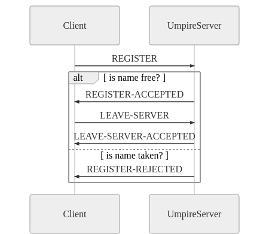

# @mgonnet/umpire

## Sequence Diagrams

### User Connection to Umpire Server

### Lobby creation

## Listening Message types

| Message       |Message data     | Response type         | Response data |
| ------------- | -------------   |-----------------------|---------------|
| REGISTER      | {name: 'pepe'}  | REGISTER-ACCEPTED     |               |
|               |                 | REGISTER-REJECTED     |               |
|               |                 | REGISTER-REJECTED     | { reason: 'User already registered' } |
| LEAVE-SERVER  |                 | LEAVE-SERVER-ACCEPTED |               |
| CREATE-LOBBY  | {name: 'lobby'} | CREATE-LOBBY-REJECTED | { reason: 'User already in lobby' } |
|               |                 | CREATE-LOBBY-REJECTED | { reason: 'Lobby name already exists' } |
|               |                 | CREATE-LOBBY-ACCEPTED |               |
| CLOSE-LOBBY   |                 | CLOSE-LOBBY-REJECTED  | { reason: 'Player is not the lobby creator' } |
|               |                 | CLOSE-LOBBY-REJECTED  | { reason: 'User is not in a lobby' } |
|               |                 | CLOSE-LOBBY-ACCEPTED  |               |
| JOIN-LOBBY    | {name: 'lobby'} | JOIN-LOBBY-REJECTED   | { reason: 'User is already in a lobby' } |
|               |                 | JOIN-LOBBY-REJECTED   | { reason: 'Lobby does not exist' } |
|               |                 | JOIN-LOBBY-ACCEPTED   |               |
| LEAVE-LOBBY   |                 | LEAVE-LOBBY-ACCEPTED  |               |
|               |                 | LEAVE-LOBBY-REJECTED  | { reason: 'Player is not inside a lobby' } |
| CHOOSE-ROL    | {rol: 'b'}      | CHOOSE-ROL-ACCEPTED   | { player: 'rataplan', rol: 'b' } |
|               |                 | CHOOSE-ROL-REJECTED   | { reason: 'Player is not inside a lobby' } |
| START-GAME    |                 | START-GAME-ACCEPTED   | { players: [{ name: 'useloom', rol: 'b' },{ name: 'rataplan', rol: 'w' } ],turn: 'w'} |
|               |                 | START-GAME-REJECTED   | { reason: 'Player is not the lobby creator' } |
|               |                 | START-GAME-REJECTED   | { reason: 'Player is not inside a lobby' } |
| MOVE          | {move: 'e4'}    | MOVE-REJECTED         | { reason: 'Not your turn' }
|               |                 | MOVE-ACCEPTED         | { player: '${currentUser.getName()}', move: '${move}', turn: turn }

## Emitted Messages
| Message              | Message data                                                                          | Trigger              | Notes |
|----------------------|---------------------------------------------------------------------------------------|----------------------|-------|
| JOINED-LOBBY         | { player: 'rataplan' }                                                                | JOIN-LOBBY-ACCEPTED  | Broadcasted to lobby when someone joins      |
| CLOSE-LOBBY-ACCEPTED |                                                                                       | CLOSE-LOBBY          | Broadcasted to lobby when the creator closes it |
| CHOOSE-ROL-ACCEPTED  | { player: 'rataplan', rol: 'b' }                                                      | CHOOSE-ROL           | Broadcasted to lobby when a player chooses a rol |
| START-GAME-ACCEPTED  | { players: [{ name: 'useloom', rol: 'b' },{ name: 'rataplan', rol: 'w' } ],turn: 'w'} | START-GAME           | Broadcasted to lobby when the creator starts the game |
| MOVE-ACCEPTED        | { player: '${currentUser.getName()}', move: '${move}', turn: turn }                   | MOVE                 | Broadcasted to lobby when the creator starst the game |

## [Specification status](doc/specStatus.md)

## References
1- Factory functions: https://medium.com/@vapurrmaid/should-you-use-classes-in-javascript-82f3b3df6195 
2- JsDoc: https://medium.com/@trukrs/type-safe-javascript-with-jsdoc-7a2a63209b76